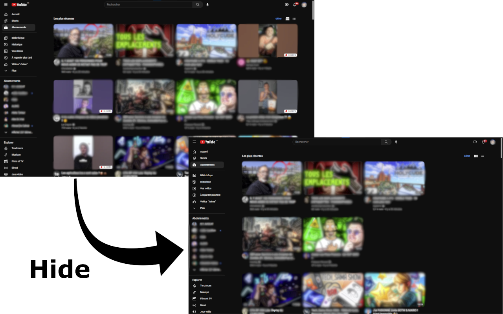
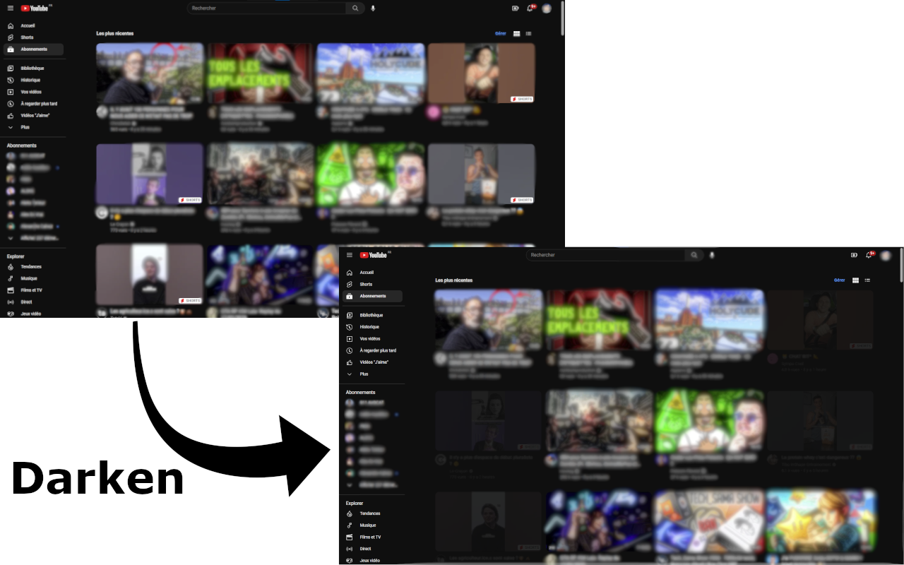
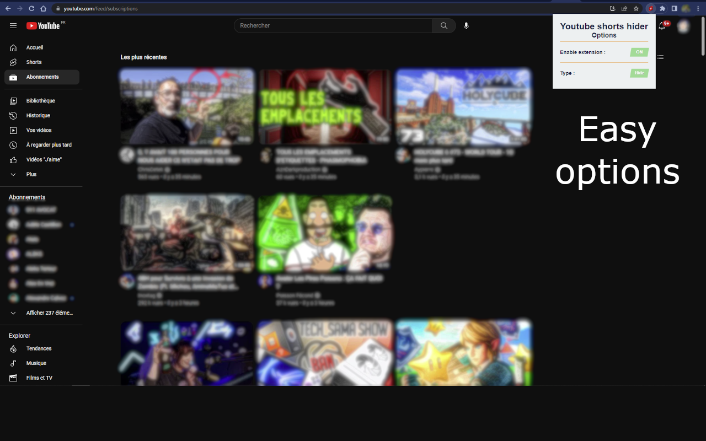

# Youtube Shorts Hider

Are you tired of being bombarded with annoying shorts in your YouTube subscription feed? Do you wish you could easily hide or dim them to make your browsing experience more pleasant? Look no further than Youtube Shorts Hider, a simple and customizable Chrome extension!

With this extension, you can easily choose to hide or darken shorts in your subscription feed, so you can focus on the content you actually want to see. You can dim them or choose to completely hide shorts altogether, depending on your preferences. And best of all, the extension is completely free and easy to use!

To install the extension, simply download it from the Chrome Web Store and click on the icon that will appear next to your address bar. You can then choose your preferred settings and enjoy a more streamlined browsing experience.

So what are you waiting for? Say goodbye to annoying shorts and hello to a more enjoyable browsing experience with Youtube Shorts Hider!

# Screenshots

# Features:

- Choose to **hide or dim** shorts in your YouTube subscription feed
- Easily **enable or disable** the extension with a single click

# Installation

To install Youtube Shorts Hider Short Hider, follow these simple steps:

- Go to the Chrome Web Store and search for "[YouTube Shorts Hider](https://chrome.google.com/webstore/detail/youtube-shorts-hider/onaddkaiklaablhimjabjcphnlmhgifi)"
- Click on "Add to Chrome" to install the extension.
- Once installed, the extension icon will appear next to your address bar.
- Click on the extension icon to open the options menu and choose your preferred settings.

# Support

If you encounter any issues with YouTube Subscription Short Hider or have any suggestions for new features, please feel free to open an [issue](https://github.com/pH0xe/Youtube-Shorts-Hider/issues) on our GitHub repository.

# License

This project is licensed under the terms of the [GNU General Public License version 3](https://opensource.org/license/gpl-3-0/)

# Works on:

- Customize the level of dimming to suit your preferences
- Allow to choose the level of dimming
